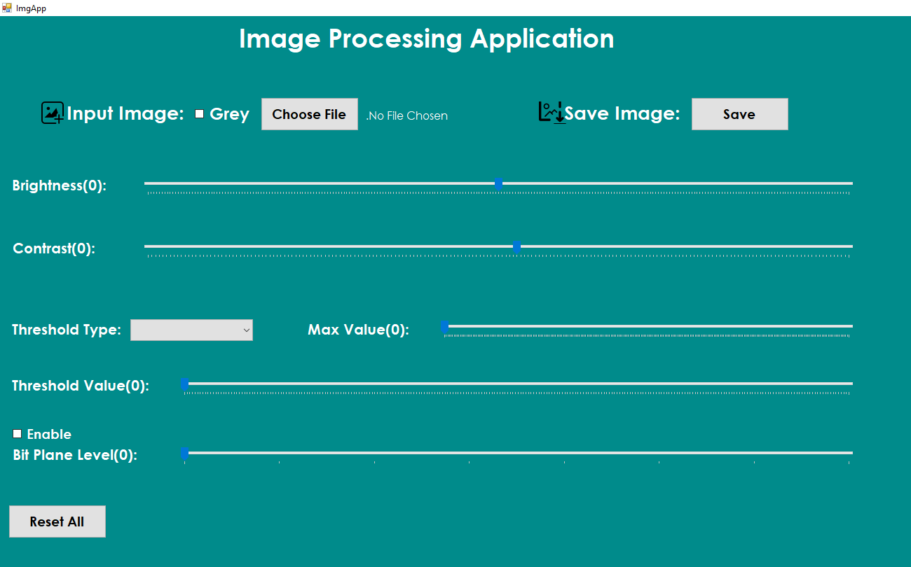
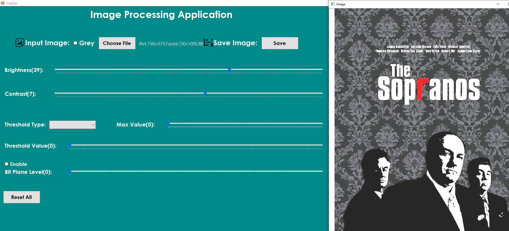

# Image processing program (xIMG/xIMGAPP)
<pre>
   • The project files with the statement as a PDF file are being uploaded to this Directory.
   This Program will be able to:
    • Opening and showing an input image
    • Modifying the brightness
    • Modifying the contrast
    • Thresholding
    • Extracting the bit planes
    • Saving the processed image
    ◘ Done Using C++ with OpenCv library. 
    ◘ In Addition to CLR Project (.NET Framework) for the GUI => c++/CLI support for v142 build tools (14.22)
</pre>

